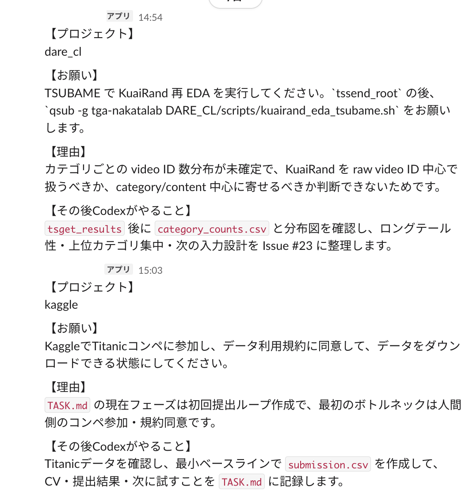

# Codex Local Sweep

## 概要

Mac の `launchd` による定期実行と Codex の非対話モード `codex exec` により、
プロジェクトでやるべきタスクを Slack で毎朝報告してくれるエージェントを構築する。

得たい成果は、**多数のプロジェクトにおいて、毎回人間が取り組むべきタスクを考えるコストを減らすこと**。
そのためのソリューションとして、今回はローカルの Codex をメインセッション上で定期実行させ、そのプロジェクトでの次取り組むべきタスクを洗い出させる。
その結果を Slack API でチャンネルに投稿する。



### 課題

課題として、

1. 複数プロジェクトで何をしていたのか・何をすべきなのかがわからなくなる → 主体的に把握するコストが大きい
  - 期間が空いた時に、以前何をしていたのかがわからない。
  - AI エージェントが動くべきなのに止まっているのか、人間が行うべき作業を行っていないから AI エージェントが作業を進めれないのかが分からない。
2. 各プロジェクトで次何をすべきか調べるときに、各プロジェクトのディレクトリで作業の様子を把握するのが面倒
  - 進捗を振り返ってタスクの順番を決めたいだけなのに、いちいち調べにいく必要がある
  → どこかで一元管理して把握したい

のようなものがある。このような管理コストに関しては、2種類のアプローチがある。

1. push 型
  - 自身で情報を把握しやすいように情報を整理する
2. pull 型
  - 自身が求める情報を自動化などの手段で整理したものを見る

このリポジトリは 2 の pull 型でのソリューションである。

### 動作イメージ

シンプルな構成になっている。

1. launchd で定期実行が走る
2. `codex exec` または `codex exec resume <session_id>` を実行する
3. プロジェクトごとの `SKILL.md` をプロンプトに含める
4. Codex の最終応答を Slack `chat.postMessage` で投稿する

## 基本構成

```text
.
├── scripts/
│   └── codex_local_sweep.py
├── configs/
│   └── project.example.json
├── skills/
│   ├── example_project_sweep/
│   │   └── SKILL.md
│   └── project_sweep_onboarding/
│       └── SKILL.md
├── launchd/
│   └── com.example.codex-sweep.project.plist.template
└── .local_agent/
    ├── .env
    └── *.log
```

`.local_agent/` と実運用 config は Git 管理しない想定。

## セットアップ

Slack Bot token を `.local_agent/.env` に置く。

```sh
mkdir -p .local_agent
printf 'SLACK_BOT_TOKEN=replace-with-your-token\n' > .local_agent/.env
```

プロジェクト用 config は example から作る。

```sh
cp configs/project.example.json configs/my_project.json
```

`configs/my_project.json` の `project_path`, `slack_channel_id`, `skill_path`, `main_session_id` などを自分の環境に合わせて行う。

### 手動テスト

Slack に送らず文面だけ確認する。

```sh
/usr/bin/python3 scripts/codex_local_sweep.py \
  --config configs/my_project.json \
  --dry-run
```

Slack に投稿する。

```sh
/usr/bin/python3 scripts/codex_local_sweep.py \
  --config configs/my_project.json
```

### launchd

`launchd/com.example.codex-sweep.project.plist.template` をコピーし、パス、label、config、ログ出力先、実行時刻を編集する。

```sh
cp launchd/com.example.codex-sweep.project.plist.template \
  ~/Library/LaunchAgents/com.example.codex-sweep.my-project.plist
```

登録する。

```sh
launchctl bootstrap gui/$(id -u) \
  ~/Library/LaunchAgents/com.example.codex-sweep.my-project.plist

launchctl enable gui/$(id -u)/com.example.codex-sweep.my-project
```

手動起動する。

```sh
launchctl kickstart -k gui/$(id -u)/com.example.codex-sweep.my-project
```

状態確認:

```sh
launchctl print gui/$(id -u)/com.example.codex-sweep.my-project | sed -n '1,70p'
```

`last exit code = 0` なら直近実行は成功。

## 複数プロジェクト

プロジェクトごとの config、skill、session id、LaunchAgent を追加する手順は [add-project-sweep.md](add-project-sweep.md) を参照する。
Codex に導入作業を任せる場合は、`skills/project_sweep_onboarding/` を使うと、
config、project skill、plist、検証コマンドの準備をまとめて進められる。
